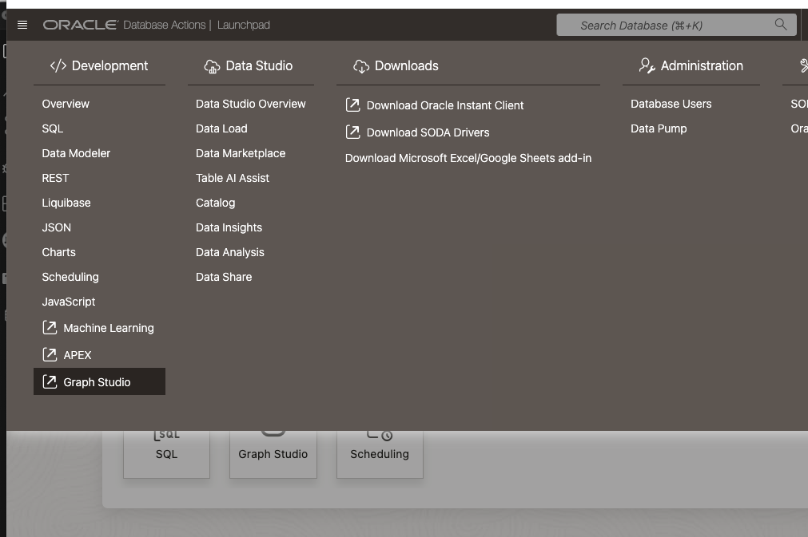
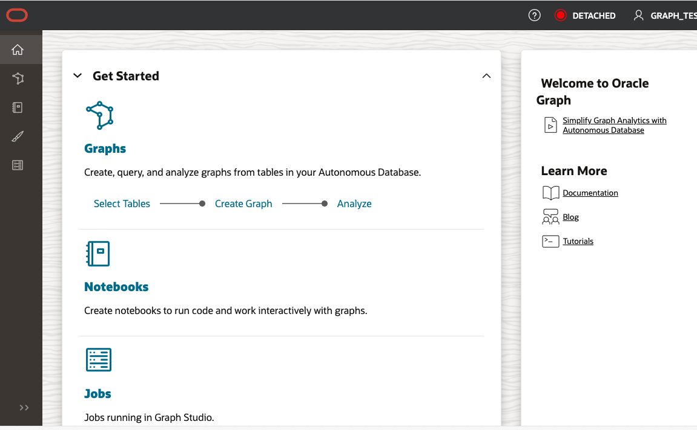
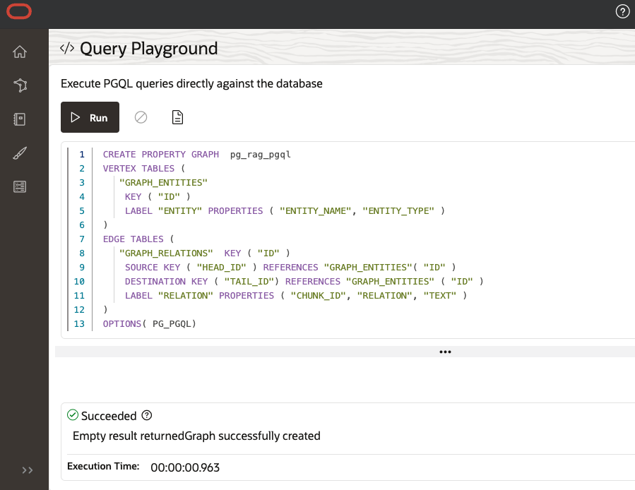
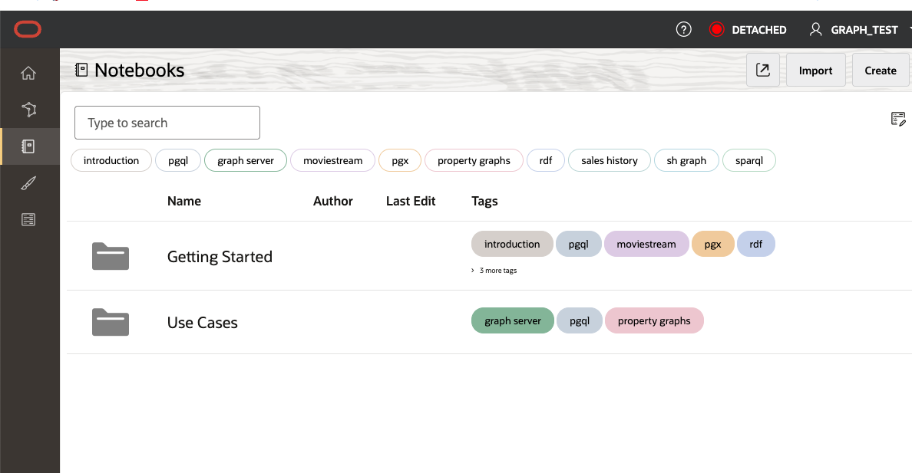
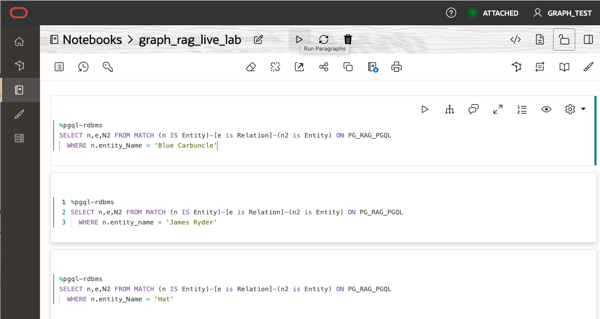
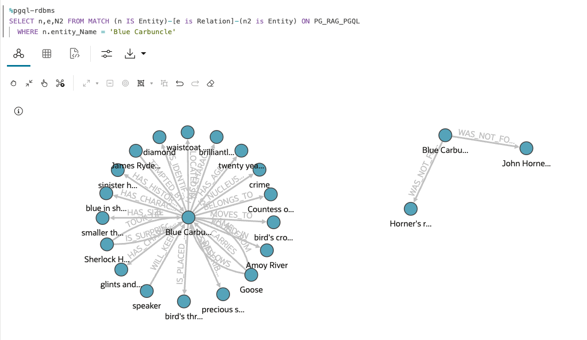
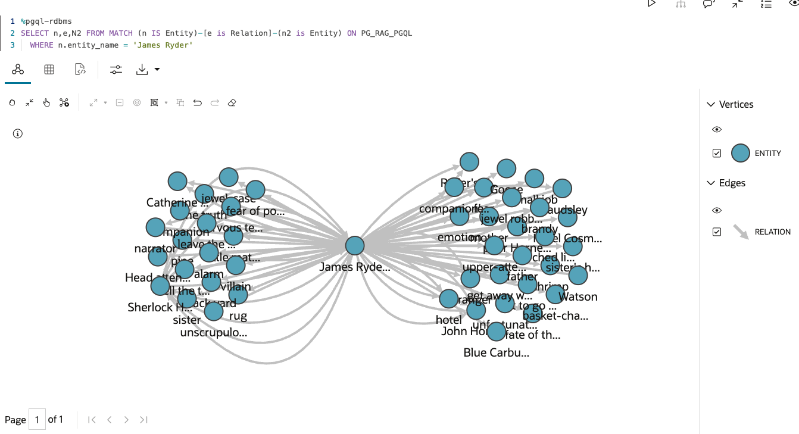
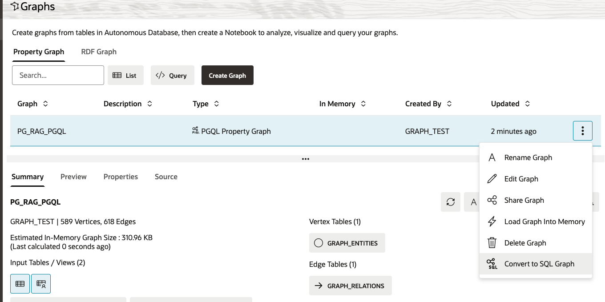
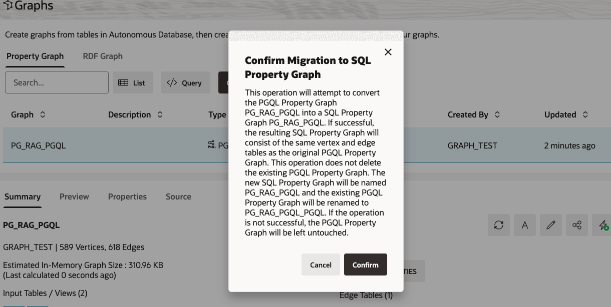
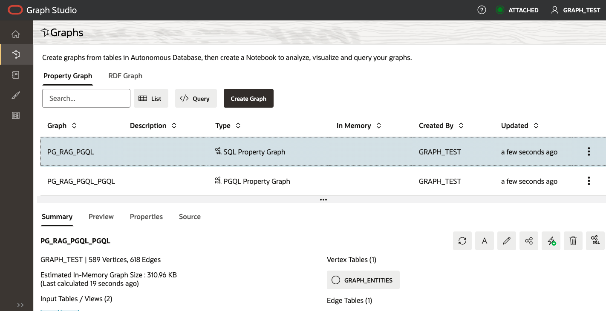

# Explore Graph Studio

## Introduction

This lab shows you how to create a property graph in Graph Studio using the data definition created in previous steps. After creating the graph, there will be steps to import a Graph Studio notebook and explore the paragraphs. Finally, you will convert the graph to SQL form to be used in the next lab.

Estimated Time: -- minutes

 
### Objectives

 

In this lab, you will:
* Create a Property Graph in Graph Studio
* Import a Graph Studio notebook and explore paragraphs
* Convert Graph to SQL format

### Prerequisites (Optional)


This lab assumes you have:
* An Oracle Cloud account
* All previous labs successfully completed


## Task 1: Create property graph in graph studio 


1. Open Database Actions, click the hamburger icon and select Graph Studio from the Development menu.

   

   

 2. Navigate to the graphs pageview but dont click the Create Graph button, click the Query button, paste the PGQL below to create a PGQL Property Graph.

       Paste the PL/SQL:

      ```text
          <copy>
            CREATE PROPERTY GRAPH  pg_rag_pgql
            VERTEX TABLES (
              "GRAPH_ENTITIES"
                KEY ( "ID" )
                LABEL "ENTITY" PROPERTIES ( "ENTITY_NAME", "ENTITY_TYPE" )
            )
            EDGE TABLES (
              "GRAPH_RELATIONS"  KEY ( "ID" )
                SOURCE KEY ( "HEAD_ID" ) REFERENCES "GRAPH_ENTITIES"( "ID" )
                DESTINATION KEY ( "TAIL_ID") REFERENCES "GRAPH_ENTITIES" ( "ID" )
                LABEL "RELATION" PROPERTIES ( "CHUNK_ID", "RELATION", "TEXT" )
            )
            OPTIONS( PG_PGQL)
          </copy>
      ```
   

   


## Task 2: Import notebook

 1. Click on the link to download the required notebook.

   [graph_rag_live_lab.dsnb](https://objectstorage.us-chicago-1.oraclecloud.com/n/idb6enfdcxbl/b/Livelabs/o/property-graph-live-lab%2Fgraph_rag_live_lab.dsnb)

   

 2. Navigate to the notebook pageview, click the import button and select the notebook downloaded in the previous step.

   


 3. Run all paragraphs using the run button and make sure show results is enabled.

   

 4. View the visualizations for each paragraph and note the relationships that have been generated.

   

   

   


## Task 3 Convert PGQL graph to SQL Graph

 1. Open the Graph page view.


 2. Click the menu button for the graph created in task 1 and select "Convert to SQL Graph".



 3. Confirm the migration to SQL Graph.



 4. Verify existence of SQL version of property graph.



## Learn More

*(optional - include links to docs, white papers, blogs, etc)*

* [URL text 1](http://docs.oracle.com)
* [URL text 2](http://docs.oracle.com)

## Acknowledgements
* **Author** - <Name, Title, Group>
* **Contributors** -  <Name, Group> -- optional
* **Last Updated By/Date** - <Name, Month Year>
